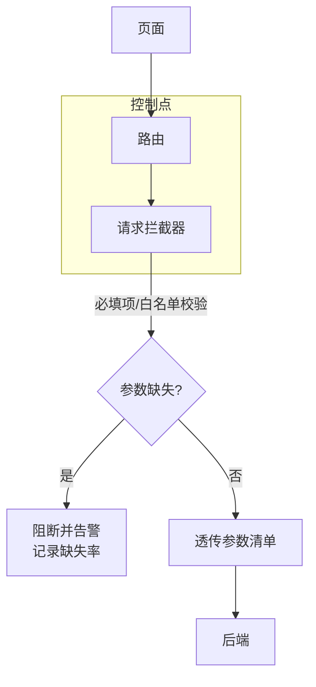
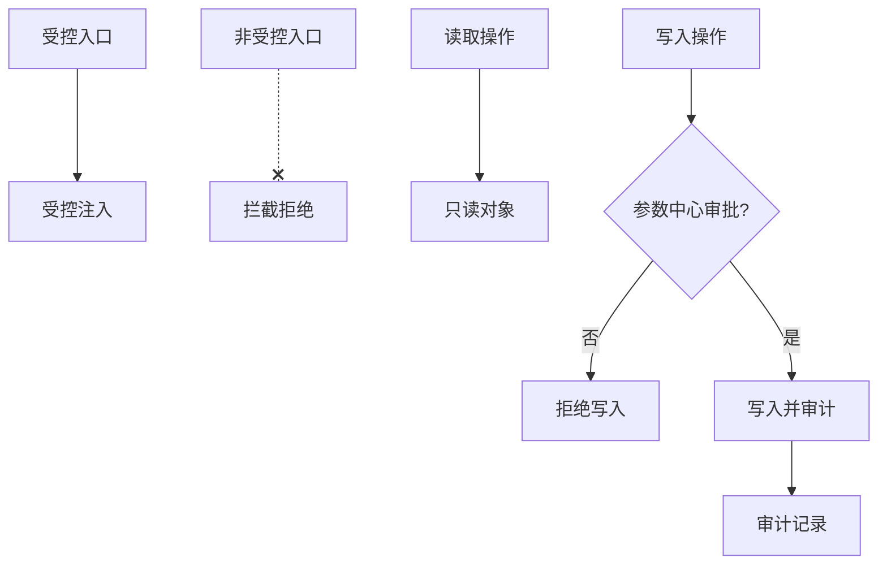
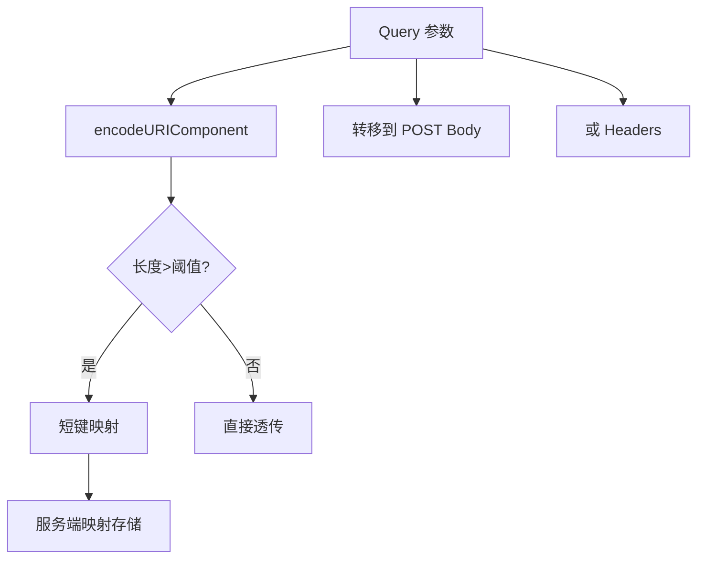
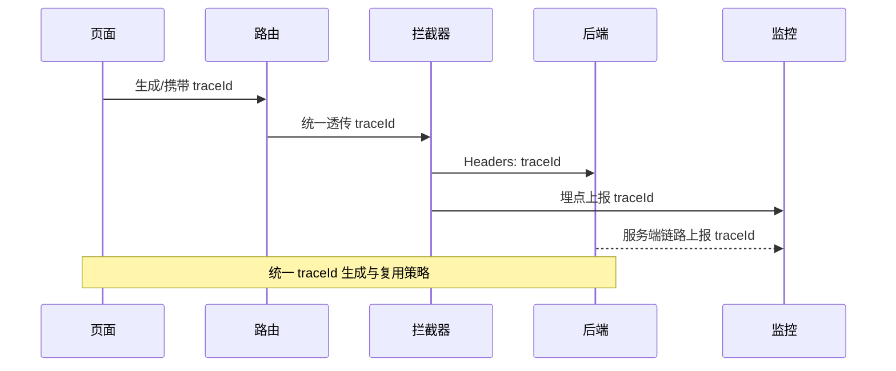

## 《前端公共参数传递规范（核心精简版）》标题框架（推荐）

### 1. 背景与目标

* 为什么需要统一公共参数传递机制
* 常见问题及影响（参数丢失、截断、污染、安全泄露等）
* 规范目标：**确保公共参数全链路可控、可验证、可监控**

---

### 2. 公共参数定义与范围

- **定义**：用于跨页面/跨服务传递身份、追踪与业务上下文的规范化参数集合。
- **纳入边界**：满足跨链路传递必要性、对全局逻辑有影响、需统一校验与监控的参数。
- **排除边界**：一次性临时值、私域组件内部状态、敏感密钥原文不纳入；敏感值仅以衍生标识纳入（如 `user_id_hash`）。
- **分类维度**：
  - 身份类（`userId`、`tokenId`）
  - 追踪类（`traceId`、`utm_source`）
  - 业务上下文类（`tenant`、`lang`、`env`）
- **生命周期与作用域**：`request`/`session`/`global`，为每个参数声明 TTL、刷新与过期策略。
- **传递载体与规则**：Query（非敏感、短）、Headers（敏感、受控）、Body（结构化、长）、Storage（受控读写、定期清理）。
- **命名约定**：统一小驼峰或下划线；前缀约定如 `ctx_` 表示上下文、`trace_id` 表示链路；避免歧义缩写。
- **单一真源**：集中在参数注册表声明字段、类型、作用域与校验；治理与白名单机制见“4.1 安全与编码规范”。

---

### 3. 关键问题与解决方案

#### 参数丢失
- **问题**：参数在页面跳转或请求中缺失，导致逻辑异常与数据不一致。
- **方案**：建立参数白名单与透传清单；路由与请求拦截器强校验必填项；设置“参数缺失率”阈值并自动告警。


#### 参数污染
- **问题**：非受控入口或错误写入导致公共参数被篡改，影响全局行为。
- **方案**：仅允许受控入口注入；读操作默认只读；所有写入通过参数中心审批并留审计记录。


#### 参数被截断
- **问题**：URL 过长或编码不当导致参数完整性受损。
- **方案**：统一使用 `encodeURIComponent`；超长参数采用短键映射或转移到 POST body/headers。


#### 敏感信息泄露
- **问题**：在 URL/日志中暴露 token、用户标识等敏感数据。
- **方案**：采用签名/加密/脱敏方案；优先通过 headers 或安全存储传递；屏蔽日志输出。
```mermaid
flowchart TD
  Param[参数] --> Sens{是否敏感?}
  Sens -- 是 --> H[Headers 传递]
  H --> Protect[签名/加密/脱敏]
  Protect --> Mask[日志屏蔽]
  Sens -- 否 --> Q[Query 传递]
  Q --> Encode[编码/最小化]
  note right of H: 避免在 URL 暴露 token/userId
```

#### 链路不可追踪
- **问题**：无法将页面跳转、请求与监控事件关联起来，难以复盘与定位断裂。
- **方案**：全链路携带 `traceId`；页面跳转、API 与埋点统一透传以支持链路复盘与断裂定位。



---

是否希望我下一步帮你把这一版转成一个正式的 Markdown 文档骨架（带占位说明，每节只留简短注释，方便你直接写内容）？
